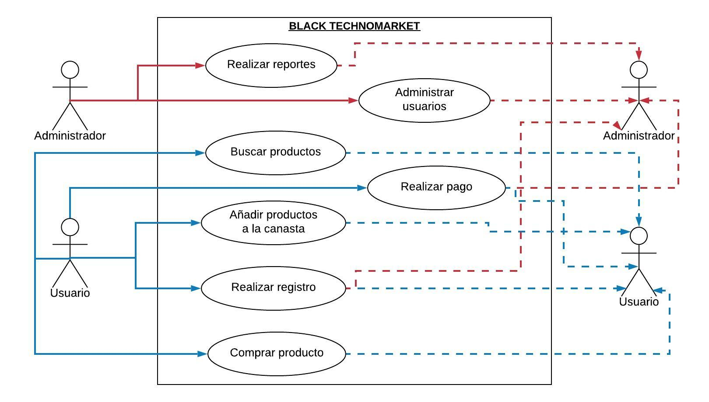

# Proyecto BLACK TECHNOMARKET

# PRESENTACION GENERAL 

El propósito de BLACK TECHNOMARKET es brindar un servicio de búsqueda y comparación de precios de los productos tecnológicos de las diferentes tiendas. 

Con BLACK TECHNOMARKET buscamos brindarle un servicio de excelente calidad a los usuarios para que las compras de sus productos tecnológicos se hagan con una facilidad, rapidez, confiabilidad y ahorro que sólo nosotros ofrecemos. 

# ANTECEDENTES

Las compras online se están convirtiendo en una práctica habitual  de la población. Más o menos 1.600 millones de usuarios en todo el mundo que han hecho compras en Internet, gastando casi 2 billones de dólares, cifra que se estima podría duplicase para el tan esperado 2020.

Un estudio hecho por SEMrush muestra que el 55.22% de las compras de aparatos electrónicos a nivel mundial son de dispositivos móviles. Estas compras son realizadas en su mayoría en países asiáticos como China y Korea del sur; en Europa los países que han registrado mayor cantidad de ventas por internet son Alemania, Reino Unido, Indonesia, India y Polonia.

Se estima que el 90% de las personas que compran en línea tienen entre 18 y 29 años y prefieren realizar sus compras a través de computadores portátiles en vez de hacerlo en tabletas o smartphones debido a la comodidad, el manejo y ahorro de tiempo en las páginas web a través del ordenador.

Además de esto, un estudio de la revista Semana reveló que a partir del incremento del IVA al 19% en Colombia, las transacciones de Amazon y otras tiendas virtuales aumentaron en un 24% con respecto al año anterior.

# PROBLEMA

Debido al crecimiento en gran magnitud de la tecnología, la sociedad y el avance de estas, es lo normal que cada tienda reconocida tenga su tienda online para brindar a sus clientes una forma rápida y segura de realizar su compra desde la comodidad de cualquier lugar y a través de un dispositivo smart.

Sin embargo, hasta el día de hoy los clientes pasan mucho tiempo en busca de su producto ideal en cuanto a precio, preferencia y calidad, es por esto que BLACK TECHNOMRKET ofrece a los usuarios en línea una forma mucho más rápida de comparar las tres cualidades dichas anteriormente para que encuentre su producto ideal.

# SOLUCIÓN

# JUSTIFICACIÓN

# DIAGRAMA DEL PROCESO DE INGENIERÍA DE SOFWARE

Proyecto de taller de lenguajes de programación 2. 2019-2
